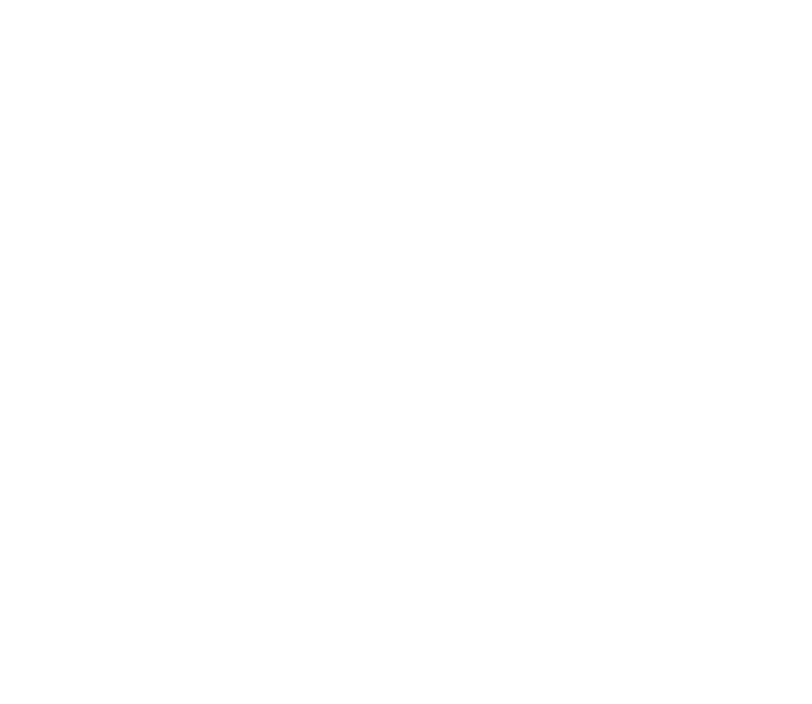

<a name="readme-top">

<br/>

<br />
<div align="center">
  <a href="https://github.com/zyx-0314/">
    
  </a>
  <h3 align="center">WD-Seatwork4</h3>
</div>
<div align="center">
A website that showcases features which combines aesthetic design, an engaging and visually appealing interface that highlights the key aspects of the product. This website is consist of hover and animation to put transitions and effects. 
</div>

<br />


---

<br />
<br />

<details>
  <summary>Table of Contents</summary>
  <ol>
    <li>
      <a href="#overview">Overview</a>
      <ol>
        <li>
          <a href="#key-components">Key Components</a>
        </li>
        <li>
          <a href="#technology">Technology</a>
        </li>
      </ol>
    </li>
    <li>
      <a href="#rule,-practices-and-principles">Rules, Practices and Principles</a>
    </li>
    <li>
      <a href="#resources">Resources</a>
    </li>
  </ol>
</details>

---

## Overview

The project is a website designed to showcase the features of a specific product. This website provides detailed information about the product, highlighting its unique features, benefits, and use cases. The purpose of the website is to apply my knowledge in css and html by designing a website that may inform potential customers about the product, and demonstrate its value. By providing comprehensive information and engaging content, the website aims to attract, educate, and convert visitors into customers.


### Key Components
- MultiPage Website
- Homepage
- Product Details Page
- Feature Highlights
- Hover
- Animations

### Technology


## Rules, Practices and Principles
1. Always use `WD-` in the front of the Title of the Project for the Subject followed by your custom naming.
2. Do not rename any .html files; always use `index.html` as the filename.
3. Place Files in their respective folders.
4. All file naming are in camel case.
   - Camel case is naming format where there is no white space in separation of each words, the first word is in all lower case while the succeding words first letter are in upper followed by lower cased letters.
   - ex.: buttonAnimatedStyle.css
5. Use only `External CSS`.
6. Renaming of Pages folder names are a must, and relates to what it is doing or data it holding.
7. File Structure to follow below.

```
WD-Seatwork4
└─ assets
|   └─ css
|   |   └─ style.css
|   └─ img
|   |   └─ fileWith.jpeg/.jpg/.webp/.png
|   └─ js
|       └─ script.js
└─ pages
|  └─ Feature-1
|  |  └─ assets
|  |  |  └─ css
|  |  |  |  └─ style.css
|  |  |  └─ img
|  |  |  |  └─ fileWith.jpeg/.jpg/.webp/.png
|  |  |  └─ js
|  |  |     └─ script.js
|  |  └─ index.html
|  |
|  └─ Feature-2
|     └─ assets
|     |  └─ css
|     |  |  └─ style.css
|     |  └─ img
|     |  |  └─ fileWith.jpeg/.jpg/.webp/.png
|     |  └─ js
|     |     └─ script.js
|     └─ index.html
|
└─ index.html
└─ readme.md
```

## Resources

| Title | Purpose | Link |
|-|-|-|
| w3schools | To learn different style of codes. | https://www.w3schools.com/css/default.asp |
| Google Fonts | To get font styles | https://fonts.google.com/ |
| fontawesome | To get fonts that serves as symbols | https://fontawesome.com |
